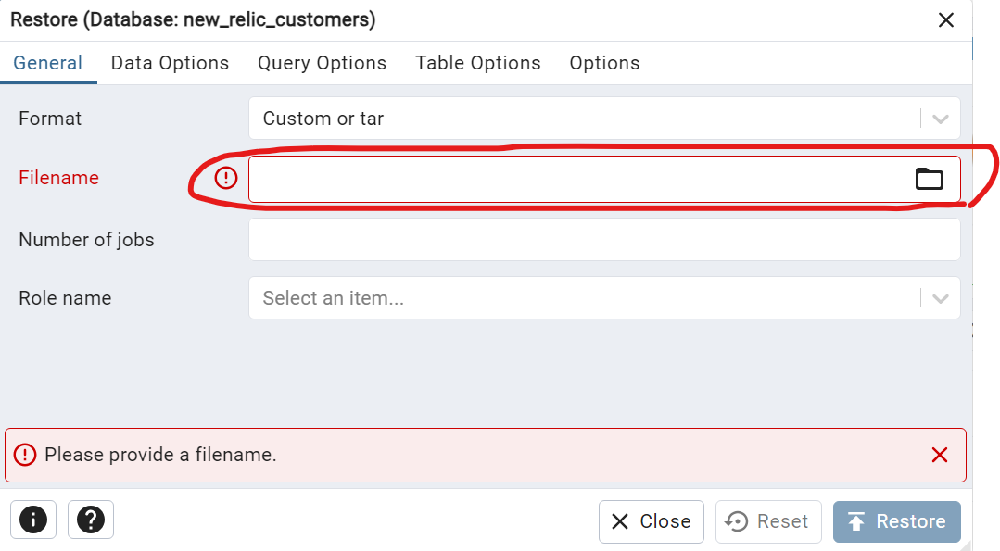

# NEW RELIC CUSTOMER LIST APP/TECHNICAL CHALLENGE

This is a programming challenge that involves creating an app that allows users to view and filter a list of customers in a variety of ways.

As per the assignment specifications, 2 basic functionalities will be included at the outset:

1. SEARCH by a customer's first name OR last name via a text input field
2. FILTER by a customer's company name via a select dropdown

# Table of contents
- [Table of contents](#table-of-contents)
- [Installation](#installation)
- [Setting up the database connection](#setting-up-the-database-connection)
- [Usage](#usage)
- [Q&A](#q%20&%20a)

# Installation
[(Back to top)](#table-of-contents)

Navigate to the directory in which you want to install the project, then run the following command:

```git clone https://github.com/kidgray/new-relic-challenge.git```

**You will need:**

Node
NPM
Angular CLI

To install Node, please navigate to

```nodejs.org```

and click on the "Download" link at the top of the page, then follow the instructions.

Once Node and NPM are installed, you will need to install Angular CLI.
To do so, open a terminal window and run the following command:

```npm install -g @angular/cli```

To install the project dependencies, navigate to the root directory of the cloned project and use
the following command:

```npm install```

NOTE: This project uses the following ports:

    Client: Port 4200
    Server: Port 3000

Please make sure these ports are available for use prior to executing it.

You may start the client by navigating to the root directory and using the command:

```ng serve```

You may start the server by navigating to the server folder and using the command:

```nodemon --inspect server.js```

OR

```node --inspect server.js```

Upon success, the app may be accessed at:

```http://localhost:4200```

## Running unit tests

While in the root directory, run `ng test` to execute the unit tests.

# Setting up the database connection
[(Back to top)](#table-of-contents)

This app uses PostgreSQL to store data. **Consequently, you will need to install the following:**

PostgreSQL
pgAdmin 4

**pgAdmin 4 is necessary in order to have a smooth setup experience**. You will need to set up
your PostgreSQL server with pgAdmin 4 such that you can manage databases.

## Restoring the seed data

I used a SQL query to seed my database with customer data. That data has been backed up and provided
in the repository.

Please navigate to the assets folder in the root directory. There, you will find the file:

new_relic_customers_db.sql

Please download (copy/paste, drag/drop, etc) this file.

You will need to create a new Database into which the backup can be restored. To do this, right click
on the Databases icon of pgAdmin 4, click Create, and click Database.


You may name the database anything you like, but I named mine

new_relic_customers

Restore the backup data by right clicking on your new database and clicking "Restore..." on the
dropdown menu that appears, then providing the backup file in the Filename input on the modal
that appears.




Once this process is complete, your database will contain the same rows as the ones in my local
environment. This completes the seeding process.

## Creating a settings.js file for your database connection

Navigate to the "server" folder in the root directory. There will be a file named

settings-example.js

In the same directory (i.e. the server folder), create a new file named

settings.js

Copy the contents of settings-example.js into it. Enter the credentials used to connect
to your PostgreSQL database in the fields of the settings object. This is necessary in order
for the backend to establish a connection to PostgreSQL.


# Usage
[(Back to top)](#table-of-contents)

## Viewing customer data

To view all customer data, simply navigate to ```http://localhost:4200``` after running
the client and server.


## Search by first name

To search for a customer by first name, simply type the first name into the search bar. The
first name will be stored as a query parameter in the URL as you type it into the search box
(as per assignment specifications).


## Search by last name

To search for a customer by last name, simply type the last name into the search bar. The
last name will be stored as a query parameter in the URL as you type it into the search box
(as per assignment specifications).


## Filter by Company

To filter the list by company, click the company dropdown box and select the company you would like to
filter on. The company name will be saved in the query parameters as per assignment specifications.


# Q & A
[(Back to top)](#table-of-contents)

This section will serve as a discussion of the project's structure in the form of a Q & A.

### Why did you choose to return Subscriptions from the API calls in the service rather than subscribing in the service itself?

In the project, I chose to keep my subscriptions in the components for two main reasons:

1. It makes the service easier to test, since the methods can be subscribed to
2. It makes it less likely for a memory leak to occur, since you can unsubscribe in the component's onDestroy method (when the component is destroyed)

### Why are you using the onPush change detection strategy?

For optimization purposes. This prevents unnecessary re-renders of Angular components. For a project
this small, it hardly matters, but it's still nice to have.

### Why did you decide to use PostgreSQL?

I simply wanted to practice working with it. I did not particularly need the consistency of a
relational DB, and joins were not necessary either, so these things did not factor in to my
decision of what DB to use.

### Why aren't there any tests for the customer-list component?

Unfortunately, I ran out of time to work on the assignment. I tried to include as many unit tests
as possible, but I am currently taking part in numerous interview processes and am therefore pressed
for time.
